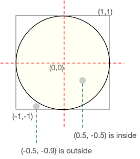
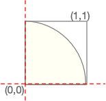
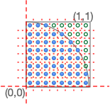

# Approximate Pi by sampling points

Pi (π) is defined as the ratio of a circle's circumference to its 
diameter, which is twice its radius. It appears in many other 
formulas in mathematics and physics, often in contexts that have 
nothing to do with geometry.  

Because π is an irrational 
number, it is not possible to represent it exactly with a Python 
floating point number, or with any rational number.  The best we can 
do is an approximation.

## Approximation methods

[Wikipedia](https://en.wikipedia.org/wiki/Approximations_of_%CF%80)
describes several methods that have been used for approximating π, 
from about 1000 BCE to current times.  Many of these involve rather 
daunting mathematical formulae involving continued fractions or 
series.  They are efficient, but difficult to understand. 

The method we will use in 
this project is not among the standard approaches, but illustrates a 
general approach for numerical estimation called _Monte Carlo 
simulation_.  Monte Carlo simulation is by no means the best or 
fastest way to estimate π, but it is useful in a wide variety of 
other estimation tasks.  Estimating π is a simple example that will 
help you understand how you might use the Monte Carlo method for 
other problems. 

### Monte Carlo methods

Monte Carlo is a city-state in Europe known for casinos and 
gambling.  Gambling typically involves a random process, such as 
rolling dice or drawing cards.  Monte Carlo simulation is a method 
of estimating something that is difficult to calculate directly by 
randomly generating many examples and counting how many of them 
satisfy a property of the thing we want to estimate.  For example, 
the 
[current best computer Go programs](https://en.wikipedia.org/wiki/AlphaGo) 
estimate the "goodness" of a 
position by playing out a number of random games from the position 
and counting the wins. 

## Estimating π from the area of a circle

We will base our Monte Carlo estimation of π by using a familiar 
formula for the area of a circle, $a = π r^2$. With a little algebra 
we can rewrite this as $\pi = \frac{a}{r^2}$.  So given any value $r$,
if we can obtain a good estimate for the area of a circle with that 
radius, we can divide by the square of $r$ to get an estimate of π.  
In particular, we could choose $r = 1$, because conveniently 
$1^2 = 1$ and $\frac{a}{1} = a$.  

The other formula we will use is the definition of a circle in a 
Cartesian plane as consisting of all the points $(x,y)$ with 
distance at most $r$ from the center of the circle.  If we place the 
center of the circle at the origin, $(0,0)$, then the points that 
belong to the circle are those for which $x^2 + y^2 \leq r$.  

If we choose $r = 1$, we can imagine a circle of radius 1 inscribed 
in a rectangle of area 4.  

We cannot count all the points within the circle or the square, 
because there are an infinite number of them. However, we can 
imagine dividing the square into very small pieces, and counting how 
many of those pieces are within the circle. If we make the small 
pieces uniform, we would expect the fraction of them that are within 
the circle to be approximately π. 

We might prefer to consider only positive values of $x$ and $y$,
inscribing a quarter of a circle in a square of size 1.  

If we do it this way, and again divide the square into very small
pieces, we expect about $\pi / 4$ of them to be within the 
quarter-circle.  It is easy to multiply by 4 to get π.

For this problem it would be easy to divide the unit square into an 
evenly spaced grid.  We might use such a method (often in three or 
more dimensions, rather than two) to estimate the volume of some 
very complex shape.  For other problems, like estimating the value 
of a position in a board game, or the survival value of a behavior 
for an organism, it is much harder to define what a "grid" might be. 
This is where the randomness of a Monte Carlo simulation comes in:  
We may be able to randomly sample a space of possibilities even if 
it does not have a simple geometric form.  We can use Monte Carlo 
method here as well, simply scattering points at random instead of 
laying them out in a grid. 

Our calculation method is the same whether we sample points along a 
grid or sample them randomly:  If we sample $N$ points, we 
expect
$\pi N / 4$ of them to be within the quarter circle. 

We will write a program to sample both ways, using a grid and randomly.

## Start your (simulated) engines